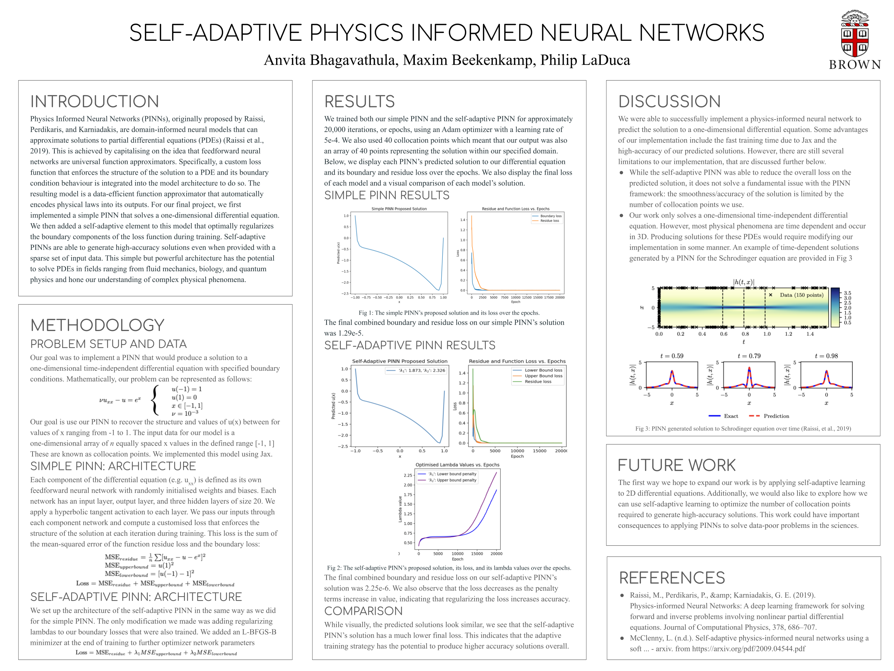

##### Project Overview

Advised by Dr. Somdatta Goswami and collaborating with two other undergraduate students, I created a PINN to solve the 1D heat equation using a custom loss function that enforced the structure of the solution and its boundary condition behaviour. Optimizing this model’s performance involved investigating loss convergence, identifying poor learning of boundary conditions, and implementing adaptive regularization. This resulted in a reduced boundary loss by six orders of magnitude. Next, we shifted our focus to handling the increased computational cost of the 2D case. We explored low-rank decomposition using forward-mode auto differentiation to separate the PINN on a per-axis basis as a strategy to do so. The repository for this project is available [here](https://github.com/philipladuca24/PINNs-Project).

##### Project Poster  

